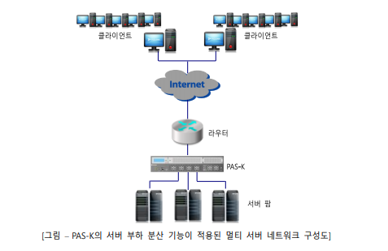
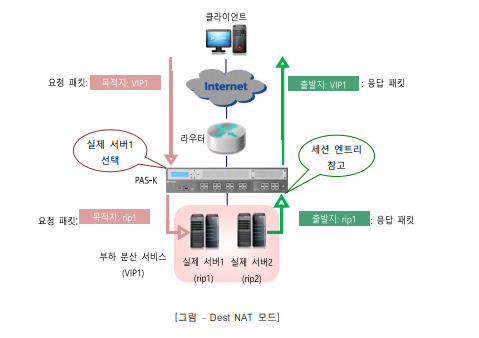
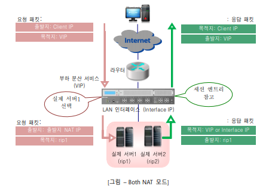
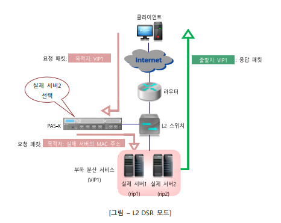

# L4 부하 분산

## 개요

PAS-K는 일반 서버, 캐시 서버, 방화벽, VPN(가상 사설망) 장비의 부하 분산(loadbalancing) 기능을 제공하여 고가용성(high availability) 구성을 가능하게 해주는 L4 스위치입니다. PAS-K의 부하 분산 기능은 각 장비들의 트래픽을 분산하여 손쉽게 성능을 확장할 수 있도록 하고, 장비의 장애 감시 기능을 통하여 장비에 장애가 발생한 경우에도 다른 장비를 통해 지속적인 서비스가 유지될 수 있도록 합니다. 이와 같이 PAS-K의 부하분산 기능이 제공하는 고가용성과 안정성을 통하여 대용량의 웹사이트나 중요한 인터넷 업무 장소, 혹은 인터넷 서비스 업체(ISP)에서 손쉽게 장비를 확장하고 유지 관리할 수 있을 뿐 아니라 24시간 중단 없는 서비스를 간단하게 구현할 수 있습니다.

PAS-K에서 제공하는 L4 부하 분산의 특징을 요약하면 다음과 같습니다.

- 네트워크 환경과 트래픽의 특성에 따라 다양하게 적용할 수 있는 여러 종류의 부하 분산 방식을 제공합니다.
- 클라이언트 기반의 지속 연결 기능(persistence)을 제공합니다.
- 기존 네트워크 환경을 변경시키지 않고 부하 분산 기능을 적용할 수 있습니다.
- 브리징(L2) 네트워크 구성과 라우팅(L3) 네트워크 구성에서 모두 사용할 수 있습니다.
- 서버 부하 분산 기능은 Dest-NAT, Both-NAT, L2 DSR, L3 DSR, LAN-to-LAN과 같은 다양한 NAT 모드를 지원합니다.
- 방화벽 부하 분산 기능은 다양한 종류의 방화벽에 적용될 수 있고 DMZ를 포함한 복잡한 방화벽 구성도 지원합니다.
- 방화벽과 VPN 장비가 동시에 존재하는 네트워크에서도 부하 분산이 가능합니다.
- 서버 부하 분산과 방화벽 부하 분산, 캐시 서버 부하 분산을 동시에 사용할 수 있습니다.
- 다양한 종류의 VPN 터널링 프로토콜과 L2TP 기반의 VPN을 지원하고 본점과 지점 간의 대칭적 VPN 기능이 강화되었습니다.
- 게이트웨이 라인의 상태를 지속적으로 모니터링하고, 내부 네트워크에서 외부 네트워크로 전송되는 트래픽을 정상적으로 연결되어 있는 게이트웨이 라인으로 분산시켜주는 게이트웨이 부하 분산 기능을 지원합니다.
- 서버 부하 분산 기능을 확장시킨 글로벌 서버 부하 분산 기능을 지원합니다.
- FTP, TFTP, H.323 등 응용 프로토콜을 지원합니다

## L4 서버 부하 분산

서버 부하 분산(Server Load Balancing-SLB)은 인터넷 트래픽을 동일한 서비스를 제공하는 여러 개의 서버들(서버 풀)에게 효율적으로 배분하여 서버의 부하를 분산시켜주는 기능입니다. 서버 부하 분산 기능을 사용한 네트워크는 다음과 같은 장점을 가질 수 있습니다.

- **서버 이용률과 네트워크 대역폭의 효율이 증가됩니다.**

  사용자의 세션 트래픽이 서버 풀에 있는 현재 가용한 서버들 중에서 부하가 적은 서버를 통해 처리됩니다. 그러므로, 하나의 서버에 트래픽이 집중되는 것을 막아주고 서버의 트래픽 처리 지연으로 인해 발생할 수 있는 대역폭의 낭비도 줄일 수 있습니다.

- **사용자에게 신뢰성 있는 서비스를 제공할 수 있습니다.**

  하나의 서버에 문제가 발생하더라도 나머지 서버들에 의해 애플리케이션과 데이터로 접속할 수 있습니다.

- **서비스의 범용성(scalability)을 높일 수 있습니다.**

  사용자가 늘어나고 서버들의 처리 용량이 부족하게 되는 경우, 기존 서비스에 영향을 주지 않고 새로운 서버를 서버 풀에 추가할 수 있습니다.

### 기존 네트워크 vs 서버 부하 분산 적용 네트워크

다음은 서버 부하 분산 기능을 사용하지 않고 여러 개의 서버를 사용하는 일반적인 네트워크 구성도입니다.

위의 그림과 같은 네트워크에서는 일반적으로 각 서버가 하나 내지는 두 개 정도의 고유한 서비스를 제공하도록 한정되어 있습니다. 만약 이런 서버들 중 하나가 많은 사용자들이 자주 사용하는 애플리케이션이나 접속이 빈번한 데이터를 제공하는 경우에는 서버에 과부하가 발생할 수 있습니다. 서버에 과부하가 발생한 상태에서는 서버가 사용자의 서비스 요청을 거부하게 되고 사용자는 다시 서버로 반복해서 서비스를 요청하게되기 때문에 전체 네트워크 성능이 떨어지게 됩니다. 이러한 상황은 사용자 요청을 처리할 수 있는 가용 서버들이 있는 경우에도 종종 발생합니다. 이와 같이 특정한 서버로만 부하가 집중되는 현상은 다음과 같이 PAS-K를 사용하여 서버 부하 분산 기능을 적용한 네트워크 구성을 통해 해결할 수 있습니다.

위와 같이 PAS-K와 서버를 연결하고 PAS-K에 서버 부하 분산 기능을 적용하면 PAS-K는 다양한 부하 분산 방식을 사용하여 사용자 트래픽을 서버 팜에 있는 적절한 서버로 배분합니다. 따라서, 앞에서 살펴본 네트워크에서 발생하던 특정 서버의 과부하 발생을 방지할 수 있습니다. 그 밖에도 PAS-K의 서버 부하 분산 기능을 사용하면 네트워크 신뢰성이 향상되고 서버를 추가하고 제거하는 과정이 한결 쉬워지게 됩니다.

참고: PAS-K의 서버 부하 분산 기능은 Linux, Windows Server, FreeBSD, Solaris, HP-UX을 포함한 모든 운영 체제의 서버에 사용될 수 있습니다

## 가상 서버 기반 부하 분산

PAS-K는 가상 서버 기반의 부하 분산(virtual server based load balancing)을 지원합니다. 이 방식은 가장 일반적인 서버 부하 분산 방식입니다. 이 방식에서 PAS-K는 가상 서버(virtual server) 역할을 수행하고, 트래픽을
분산 시킬 서버 그룹(서버 팜)에 대한 가상 서버 IP 주소(혹은 주소 범위)를 가집니다. 클라이언트는 서버의 실제 IP 주소 대신 가상 IP 주소를 사용하여 서비스를 요청하게 됩니다. 이 방식은 가상 IP 주소 하나로 HTTP, TELNET, FTP, DNS 등과 같은 서비스를 제공하는 실제 서버를 여러 개 연결하여 서비스 용량을 증가시킴은 물론 서비스의 품질을 향상시키고 일부 서버의 장애도 자동적으로 극복할 수 있도록 해줍니다.

PAS-K에서는 가상 서버를 서버 부하 분산 서비스라고 합니다. 서버 부하 분산 서비스는 가상 IP 주소로 수신된 트래픽을 서비스에 지정된 부하 분산 방식을 사용하여 실제 서버로 전송해줍니다. PAS-K에는 1024개의 서버 부하 분산 서비스를 동작 시킬 수 있습니다.

## 필터

PAS-K는 트래픽 중에서 L4 서버 부하 분산을 적용할 트래픽을 정의하기 위해 필터를 사용합니다. 필터는 프로토콜과 출발지/목적지 IP 주소, 출발지/목적지 포트 번호 등을 다양하게 조합하여 정의할 수 있습니다. 필
터의 종류에는 ‘include’ 타입과 ‘exclude’ 타입이 있습니다. Include 타입의 필터에는 L4 서버 부하 분산을 적용할 트래픽의 조건이 포함됩니다. 그리고 exclude 타입의 필터는 L4 서버 부하 분산을 적용하지 않을 트래픽의 조건으로 구성됩니다. 필터를 설정하지 않은 경우에는 설정한 가상 IP 주소를 목적지 IP 주소로하는 include 타입의 필터가 자동으로 생성되며, 가상 IP 주소 삭제시 해당 필터도 자동으로 삭제됩니다.

## 서버 부하 분산의 NAT 모드

서버 부하 분산 서비스가 적용된 네트워크에서 클라이언트는 가상 IP 주소를 사용하여 서버로 데이터를 요청하게 됩니다. PAS-K는 이러한 클라이언트의 요청을 수신하면 지속 연결과 부하 분산 방식을 사용하여 실제서버를 선택한 후 요청 패킷의 목적지 주소를 가상 IP 주소 대신 실제 서버의 IP 주소로 변환(NAT)한 후에 실제 서버로 전송합니다. 실제 서버에서 클라이언트로 응답을 전송할 때에도 PAS-K는 응답 패킷의 출발지 주소를 실제 서버의 IP 주소에서 가상 주소로 바꾸어서 클라이언트로 전송합니다.

PAS-K는 서버 부하 분산 서비스에서 클라이언트와 실제 서버 간에 가상 IP 주소와 실제 IP 주소를 변환해주는 다음과 같은 5가지의 NAT 모드를 지원합니다.

- Dest NAT(Destination NAT) 모드
- Both NAT 모드
- L2 DSR 모드
- L3 DSR 모드
- LAN-to-LAN 모드

L2 DSR(Direct Server Return) 모드와 L3 DSR 모드, LAN-to-LAN 모드는 서버 부하 분산 서비스에서만 사용할 수 있고, Dest NAT 모드와 Both NAT 모드는 서버 부하 분산 서비스 및 고급 L4 서버 부하 분산 서비스 모두 사용할 수 있습니다. 각 NAT 모드에 대해 살펴봅니다.

### Dest NAT(Destination NAT) 모드

Dest NAT 모드는 가장 일반적으로 서버 부하 분산 서비스에 사용되는 NAT 모드입니다. Dest NAT 모드에서 PAS-K는 앞에서 설명한 서버 부하 분산 서비스의 NAT 기능을 그대로 수행합니다. 즉, 클라이언트가 전송한
패킷의 목적지 주소를 가상 IP 주소에서 실제 서버의 IP 주소로 변환하여 실제 서버로 전송하고, 실제 서버가 전송하는 응답 패킷의 출발지 주소를 실제 서버의 IP 주소에서 가상 IP 주소로 변환한 후 클라이언트로 전송합니다. 다음은 PAS-K에 Dest NAT 모드로 설정된 서버 부하 분산 서비스가 동작 중인 경우, 클라이언트와 실제 서버 간에 송수신되는 패킷의 출발지/목적지 주소가 변환되는 과정을 보여주는 그림입니다.

### Both NAT 모드

Both NAT 모드는 Dest NAT 모드와 유사하게 동작합니다. 그러나, 목적지 주소만 변환하는 Dest NAT 모드와 달리 패킷의 출발지 IP 주소를 사용자가 설정한 출발지 NAT IP 주소로 변환하여 전송합니다.

## L2 DSR 모드

L2 DSR 모드에서는 클라이언트가 PAS-K를 통해 실제 서버로 요청을 전송하고, 실제 서버는 PAS-K를 통하지 않고 바로 클라이언트로 응답을 전송합니다. 클라이언트의 요청을 수신한 PAS-K는 실제 서버를 선택한 후에 요청 패킷의 목적지 MAC 주소를 부하 분산된 실제 서버의 MAC 주소로 변경한 다음 실제 서버로 전송합니다. 따라서, 실제 서버는 MAC 주소가 자신의 MAC 주소와 일치하기 때문에 일단 패킷을 수신하지만 목적지 IP 주소가 자신의 IP 주소가 아니기 때문에 응답을 하지 않습니다. 이러한 문제가 발생하는 것을 방지하기 위해서는 서버에 별도의 구성 작업을 수행해야 합니다.

서버의 OS 종류나 네트워크의 구성 환경에 따라 다양한 방법의 설정이 있으므로 서버의 환경에 알맞은 방법으로 설정합니다. 기본적인 구성 방식은 다음과 같습니다.

- 서버 부하 분산 서비스의 가상 IP 주소를 실제 서버에 추가하여 실제 서버가 클라이언트의 요청에 응답할 수 있도록 설정합니다.
- 위와 같은 구성을 했을 경우, 가상 IP 주소에 대한 ARP 응답을 실제 서버가 직접 하게 되므로 L2 DSR 모드로 설정된 서버 부하 분산 서비스가 정상적으로 동작하지 않는 경우가 발생할 수 있습니다. 이를 방지하기 위하여, 실제 서버에서 ARP 요청 대한 응답을 하지 않도록 설정합니다.

L2 DSR 모드는 FTP(File Transfer Protocol)나 스트리밍(streaming) 서비스와 같이 클라이언트로 전송하는 업로드 트래픽이 많은 애플리케이션을 제공하는 서버에 주로 사용됩니다. L2 DSR 모드는 PAS-K를 거치지 않고 클라이언트로 트래픽을 전송하기 때문에 PAS-K의 부하를 줄일 수 있습니다. 대신, 실제 서버에 별도의 구성 작업을 해야 하는 번거로움이 있습니다.

다음 그림은 PAS-K에 L2 DSR 모드로 설정된 서버 부하 분산 서비스가 동작 중인 경우, 클라이언트와 실제 서버 간에 송수신되는 패킷의 출발지/목적지 주소가 변환되는 과정을 보여주는 그림입니다. 그림에서처럼 응답 패킷은 PAS-K를 거치지 않고 실제 서버에서 클라이언트로 바로 전송됩니다.

